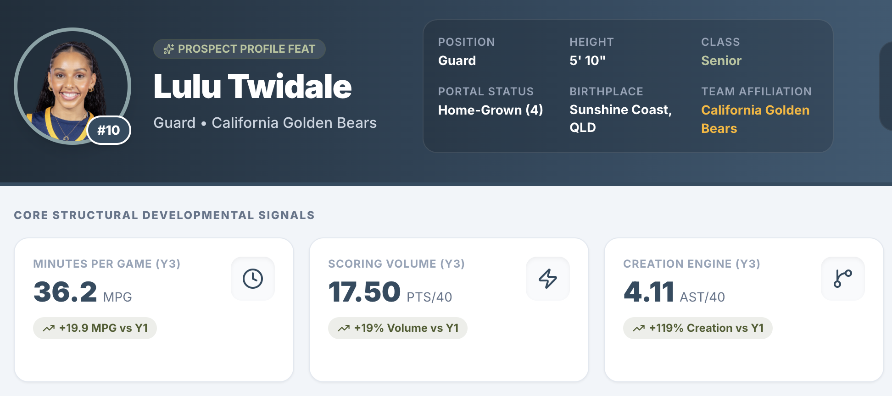
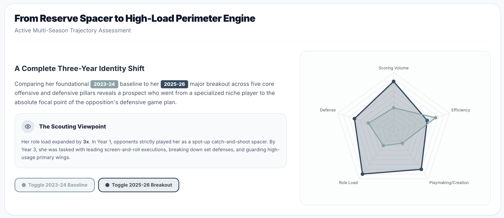

# Lulu Twidale Development Report

**A WBB player development profile tracking Lulu Twidale’s role growth, scoring efficiency, and playmaking progression at Cal from 2023-24 through 2025-26.**

This project packages a notebook-style player development report for Lulu Twidale's first three California seasons. It combines season-level production, team and player play-by-play profile history, on/off context, recent form, and lineup evidence to show how her role, efficiency, decision-making, and overall skill development evolved from reserve guard to high-minute creator.

## Preview

<p align="center">
  
</p>

<p align="center">
  
</p>

## How To Use This Repo

1. Start with `notebooks/index.html` to read the full development story in notebook form.
2. Use the evidence tables in `data/processed/` to inspect season history, shot profile, on/off context, recent form, and lineup context behind the notebook.
3. Regenerate the docs and rerun the checks after any data or wording update:

```bash
python scripts/init_project.py
python scripts/validate_data.py
python scripts/publish_check.py
```

## Live Project

- **HTML Notebook**: https://kbsmd-sportsmusicdata.github.io/wbb-player-development-report/
- **GitHub Repo:** https://github.com/kbsmd-sportsmusicdata/wbb-player-development-report

## Project Status

Published

## Why This Project Matters

Player development reports often flatten growth into one headline. This repo separates Lulu Twidale's role growth, efficiency changes, shot-profile evolution, and on-court context so reviewers can see what improved, what held steady, and what still needs caution.

## Key Questions

- How did Lulu Twidale's role change from her first California season through 2025-26?
- Where did the biggest gains show up: efficiency, playmaking, shot mix, or lineup impact?
- Which parts of the development story are strongest enough to trust, and which parts still need context or caution?

## Audience

- Player development and coaching staff
- Basketball operations and scouting reviewers
- Front office
- WNBA analytics departments

## Project Outputs

- Primary deliverable: HTML notebook
- Notebook path: `notebooks/index.html`
- Report path: `docs/executive_summary.md`

## Supporting Evidence Tables

- `data/processed/lulu_season_history.csv`: season-level role, scoring, efficiency, and usage progression.
- `data/processed/california_pbp_profile_history.csv`: play-by-play-derived profile history and shot/creation context.
- `data/processed/california_player_on_off.csv`: on/off context for lineup impact evaluation.
- `data/processed/lulu_recent_form_2026.csv`: recent-game form and late-season performance context.
- `data/processed/lulu_regular_lineup_summary.csv`: lineup context and regular rotation evidence.

## Methodology Summary

See [`docs/methodology.md`](docs/methodology.md).

## Validation Summary

See [`docs/validation_report.md`](docs/validation_report.md). Current warnings mostly reflect expected missing context fields, including unavailable 2023-24 on/off coverage and season-specific play-by-play sparsity, rather than broken files.

## Data Dictionary

See [`docs/data_dictionary.md`](docs/data_dictionary.md).

## Repo Structure

```text
/data
/docs
/notebooks
/reports
/scripts
/sql
/templates
```

## How To Run

```bash
pip install -r requirements.txt
python scripts/generate_docs.py
python scripts/validate_data.py
python scripts/generate_readme.py
```

## Future Extensions

- Add a one-page printable player development brief for coaching or scouting review
- Reuse the same reporting template for additional WBB players or team-development profiles
- Add a lightweight comparison layer against similar high-minute guards
- Refresh the notebook after the 2026-27 season closes with final season totals
